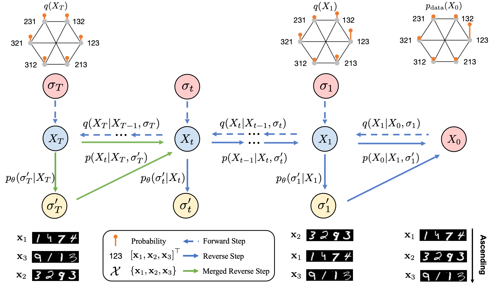

# SymmetricDiffusers: Learning Discrete Diffusion on Finite Symmetric Groups

<p align="center">

</p>


This is the official PyTorch implementation for the paper:

**SymmetricDiffusers: Learning Discrete Diffusion on Finite Symmetric Groups**

**Authors:** Yongxing Zhang, Donglin Yang, Renjie Liao

**Abstract:** Finite symmetric groups $S_n$ are essential in fields such as combinatorics, physics, and chemistry. However, learning a probability distribution over $S_n$ poses significant challenges due to its intractable size and discrete nature. In this paper, we introduce *SymmetricDiffusers*, a novel discrete diffusion model that simplifies the task of learning a complicated distribution over $S_n$ by decomposing it into learning simpler transitions of the reverse diffusion using deep neural networks. We identify the riffle shuffle as an effective forward transition and provide empirical guidelines for selecting the diffusion length based on the theory of random walks on finite groups. Additionally, we propose a generalized Plackett-Luce (PL) distribution for the reverse transition, which is provably more expressive than the PL distribution. We further introduce a theoretically grounded "denoising schedule" to improve sampling and learning efficiency. Extensive experiments show that our model achieves state-of-the-art or comparable performances on solving tasks including sorting 4-digit MNIST images, jigsaw puzzles, and traveling salesman problems.

**arXiv:** To be updated

## Requirements
Install requirements:
```bash
pip install -r requirements.txt
```

## Datasets

### Sort 4-Digit MNIST Numbers

The dataset we use for sorting 4-digit MNIST numbers is generated on the fly using the MNIST dataset.
The MNIST dataset will be downloaded automatically when running the code.

### Jigsaw Puzzle: NoisyMNIST Dataset

When dividing up an MNIST image into patches, there may be identical background patches which are all black and indistinguishable.
To avoid such scenerios, we add Gaussian noises to the MNIST dataset to obtain the NoisyMNIST dataset.
Google drive link:
https://drive.google.com/drive/folders/12vGK6YE8S6LmMeNWEWyxS0unLvS7P8ue?usp=sharing

The train set is `train_noisy_mnist.pt`.

The test sets are `test_noisy_mnist_num_pieces=i.pt`, where `i` ranges from 2 to 6.
The test sets are images that are already pre-chunked. (We don't want to randomly chunk the images each time we run a test.) `num_pieces` is the number of pieces *per side*, so that there would be a total number of `num_pieces**2` pieces.


### TSP Dataset 

We use the TSP-20 dataset from https://github.com/chaitjo/learning-tsp?tab=readme-ov-file.
You can download from 
```bash
pip install gdown
gdown https://drive.google.com/uc?id=152mpCze-v4d0m9kdsCeVkLdHFkjeDeF5
tar -xvzf tsp-data.tar.gz data/tsp/
```

## Config Files

We use json files for configs. 
For the keys and the descriptions of the keys, please see `configs/config_descriptions.json`.

## How to Run

For training and then eval, set the `eval_only` key in the config file to `false`. 
For evaluation only, set the `eval_only` key in the config file to `true`.

Run 
```bash
torchrun --standalone --nproc_per_node=4 \
main.py \
--config_json $PATH_TO_CONFIG_FILE \
--ckpt_dir $PATH_TO_CKPT_DIR \
--gpu "0,1,2,3"
```
Remember to change the number of GPUs accordingly.
